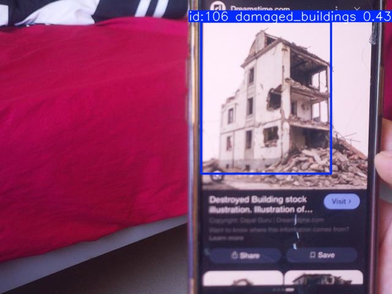
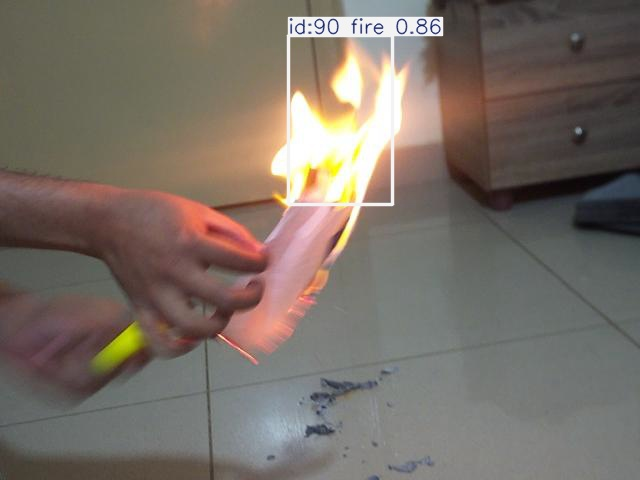
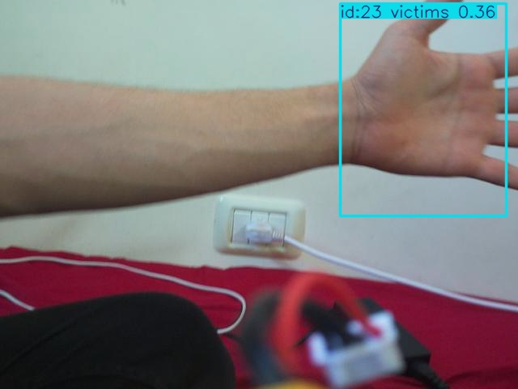

# Eagle-Aid: AI Disaster-Response Drone Prototype

**Author: Majed Sleiman — MSc, Computer and Communication Engineering**

A ground-station computer vision prototype for detecting **damaged buildings, victims, and fire** from a Raspberry Pi camera stream. The system combines a YOLOv8 detector, ByteTrack tracking, a Flask dashboard, screenshot capture, and CSV logging. Optional MAVLink telemetry associates detections with the drone's reported position.

## Architecture

The Raspberry Pi provides camera video over the local network. A laptop receives the stream and runs detection/tracking. The dashboard presents annotated video and session logs. Pixhawk telemetry can provide drone coordinates.

**Inference in this implementation runs on the laptop, not on the Raspberry Pi.** These scripts do not command the aircraft or implement autonomous navigation. The original Raspberry Pi camera-server script was not supplied.

## Checkpoint evidence

The included `models/best.pt` identifies **YOLOv8n**, created with Ultralytics **8.4.19**, with these embedded metrics:

| Metric | Value |
|---|---:|
| Precision | 81.74% |
| Recall | 76.64% |
| mAP@50 | 82.44% |
| mAP@50–95 | 51.45% |

These are metrics stored in the supplied checkpoint, not a newly run evaluation. mAP is not the percentage of correct predictions. Dataset split membership, per-class metrics and generalization to real disaster scenes have not been independently verified here.

| Class ID | Checkpoint label |
|---|---|
| 0 | damaged_buildings |
| 1 | victims |
| 2 | fire |

Stored training configuration: 80 requested epochs, image size 768, batch 16, patience 100, workers 8, optimizer auto, mosaic 1.0, close_mosaic 10. Requested epochs do not establish how many epochs actually completed. Other project experiments may have used different models and settings; they are not attributed to this checkpoint.

## Contents

| Path | Purpose |
|---|---|
| `src/predict.py` | Image, video, webcam or stream inference |
| `src/dashboard.py` | Ground-station dashboard, tracking and session logging |
| `models/best.pt` | Supplied checkpoint, included in this ZIP |
| `examples/detections/` | Six original annotated screenshots |
| `examples/logs/` | Two original CSV logs |
| `docs/model_metadata.json` | Checkpoint metadata and SHA-256 |
| `docs/log_summary.json` | Counts and attachment cross-checks |
| `docs/DATASETS.md` | Prior dataset provenance and reproducibility gaps |
| `docs/REVIEW.md` | Evidence, limitations and remaining work |
| `archive/` | Three original Python scripts, unchanged |

## Install (Windows PowerShell)

Use Python 3.11 in a new virtual environment. Dependency installation and end-to-end inference still need verification on the target laptop.

```powershell
cd eagle-aid
python -m venv .venv
.\.venv\Scripts\Activate.ps1
python -m pip install -r requirements.txt
```

For telemetry support, install `requirements-telemetry.txt` instead. CPU is the default. To use NVIDIA acceleration, configure a compatible PyTorch/CUDA installation and pass `--device 0`.

## Run inference

Use a fresh, unannotated image or video for inference. The supplied screenshots already contain boxes and labels, so rerunning detection on them is not a clean evaluation.

```powershell
python src/predict.py --source "C:\path\to\unannotated-image.jpg"
python src/predict.py --source "C:\path\to\video.mp4"
python src/predict.py --source 0 --imgsz 416
```

Predictions are saved below `outputs/`. Training used image size 768; the live dashboard defaults to 416 for a speed/accuracy tradeoff. Changing inference resolution can affect results.

## Run the dashboard

Substitute the actual Raspberry Pi IP address and camera endpoint:

```powershell
python src/dashboard.py --source "http://YOUR_PI_IP:5000/video_feed"
```

Open `http://127.0.0.1:5000`. A webcam (`--source 0`) or local video file is also supported.

Optional telemetry:

```powershell
python -m pip install -r requirements-telemetry.txt
python src/dashboard.py --source "http://YOUR_PI_IP:5000/video_feed" --telemetry "udp:127.0.0.1:14551"
```

The flight-controller/ground-station setup must already forward MAVLink to that endpoint. No flight commands are sent by the dashboard. Missing or stale coordinates are left empty. Reported coordinates are the **drone position**, not geolocated victim/fire/building coordinates.

Each start creates a new UTC-named session under `outputs/sessions/`, preserving previous logs. One worker runs inference for all viewers. Detections are logged once per `(class ID, track ID)` within a session. Tracker IDs may change after occlusion, so counts do not reliably establish unique real-world objects. A source disconnect ends processing; restart to reconnect. The prototype uses Flask's local development server and is intended for a local demonstration.

## Demo examples

These images illustrate original outputs, not independently labeled evaluation samples.

**Damaged-building demonstration: detection of a building photograph displayed on a phone.**



**Fire demonstration: annotated indoor capture.**



**Failure example: the model labels a hand/arm region as a victim.**



## Hardware recorded in project history

F450 frame, Pixhawk 2.4.8, Radiolink M8N GPS, A2212 1000KV motors, 30A ESCs, 1045 propellers, 3S 3500mAh battery, 5V/3A UBEC, Raspberry Pi 4 (8GB), Arducam IMX708 autofocus camera, and FlySky RC. This inventory comes from project history; supplied files do not independently verify the assembled hardware or flight tests.

## Original scripts

- `archive/tt.py`: no-telemetry dashboard.
- `archive/ty.py`: telemetry dashboard with a separate camera-read thread.
- `archive/web_dashboard_tracking.py`: telemetry dashboard with synchronous camera reads.

These are preserved for provenance, not recommended entrypoints. They use hardcoded paths/endpoints, overwrite their CSV on startup and perform inference per video request. Telemetry variants wait for a heartbeat during initialization. The organized entrypoints address session preservation and shared inference; they are new code and still require hardware validation.

## Verification and publishing

Python compilation, CLI help, file integrity, image decoding, checkpoint metadata inspection and CSV inspection passed. No runtime detection, camera connection, MAVLink test or full dependency installation was performed in the preparation environment. See `docs/REVIEW.md`.

The model is ignored by Git by default but included in the delivery ZIP. Before publishing dataset images or distributing weights, check source dataset and model terms. No new blanket license has been added to the supplied assets. Training and merge scripts, final dataset YAML, and evaluation artifacts are still needed for a fully reproducible repository.
